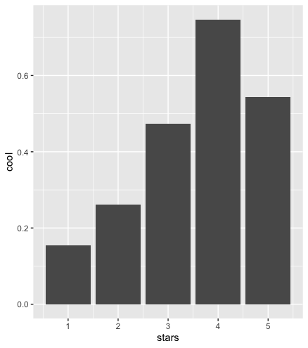
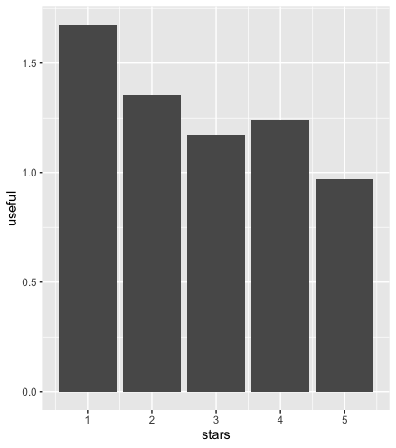
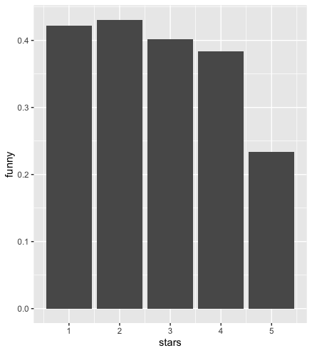

```{r setup, include=FALSE}
knitr::opts_chunk$set(echo = TRUE)
library(knitr)
library(readr)
```

```{r, include=FALSE}
options(tinytex.verbose = TRUE)
```

Tabula statement

We're part of an academic community at Warwick.

Whether studying, teaching, or researching, we're all taking part in an expert conversation which must meet standards of academic integrity. When we all meet these standards, we can take pride in our own academic achievements, as individuals and as an academic community.

Academic integrity means committing to honesty in academic work, giving credit where we've used others' ideas and being proud of our own achievements.

In submitting my work I confirm that:

1.  I have read the guidance on academic integrity provided in the Student Handbook and understand the University regulations in relation to Academic Integrity. I am aware of the potential consequences of Academic Misconduct.

2.  I declare that the work is all my own, except where I have stated otherwise.

3.  No substantial part(s) of the work submitted here has also been submitted by me in other credit bearing assessments courses of study (other than in certain cases of a resubmission of a piece of work), and I acknowledge that if this has been done this may lead to an appropriate sanction.

4.  Where a generative Artificial Intelligence such as ChatGPT has been used I confirm I have abided by both the University guidance and specific requirements as set out in the Student Handbook and the Assessment brief. I have clearly acknowledged the use of any generative Artificial Intelligence in my submission, my reasoning for using it and which generative AI (or AIs) I have used. Except where indicated the work is otherwise entirely my own.

5.  I understand that should this piece of work raise concerns requiring investigation in relation to any of points above, it is possible that other work I have submitted for assessment will be checked, even if marks (provisional or confirmed) have been published.

6.  Where a proof-reader, paid or unpaid was used, I confirm that the proofreader was made aware of and has complied with the University's proofreading policy.

7.  I consent that my work may be submitted to Turnitin or other analytical technology. I understand the use of this service (or similar), along with other methods of maintaining the integrity of the academic process, will help the University uphold academic standards and assessment fairness.

## 1. Introduction

In the early 2000s, the significance of online user reviews and their impact on product sales gained widespread recognition [@chevalier2006a]. Leveraging this information source has become instrumental for businesses in understanding consumer behaviour and enhancing profitability. Notably, the application of machine learning, particularly deep learning, has become prevalent in analysing user reviews, with a particular emphasis on the hospitality and tourism industry [@dickinger2015; @alaei2019]. One of the common approaches is sentiment analysis which involves categorising the textual content into positive, neutral, and negative sentiments [@schmunk2013]. To better predict the user reviews, sentiment, captured by the count of positive and negative words in the review text, is introduced as one of the variables, alongside other variables available in the datasets.

## 2. Related work

Literature in review rating prediction using Yelp datasets was well-documented, with an extensive evaluation of both machine learning and deep learning models [@elkouri2015; @asghar2016; @a.rafay2020; @liu2020; @liuz2020]. Surprisingly, most researchers found that logistic regression models tend to outperform other supervised learning algorithms such as random forest, support vector machine (SVM) and Naive Bayes Classifier. They yield accuracy ranged between 64-65% with some variations in training times [@elkouri2015; @liu2020; @liuz2020; @asghar2016]. However, there are mixed findings in the comparison between machine learning and deep learning methods[^1].

[^1]: Mostly Long Short Term Memory (LSTM) and Bidirectional Encoder Representations from Transformers (BERT)

Additionally, in terms of text pre-processing, the td-idf transformer or vectorizer was used to generate weight of each word, as the length of the text may affect the count for "buzzwords" [@elkouri2015; @asghar2016; @a.rafay2020; @liu2020; @liuz2020]. Also, more sophisticated natural language processing models were employed to extract the true meaning of textual data [@leung2006integrating; @pang2008opinion; @qu-etal-2010-bag].

## 3. Data setup

### 3.1 Data preparation

In terms of sentiment analysis, a structured pre-processing approach, as suggested in previous literature, was employed to enhance the classification of textual data [@noori2021]. Using a curated list of prevalent positive and negative words commonly employed by online users[^2], the text in review data was converted into lower case, with punctuation, digits and English "Stop words[^3]" removed. Here are some examples of negative and positive words:

[^2]: Available online at github:\
    - positive-text.txt: <https://gist.github.com/mkulakowski2/4289437#file-positive-words-txt-L9>\
    - negative-text.txt: <https://gist.github.com/mkulakowski2/4289441>

[^3]: Words like \`the', \`that', \`is' etc, occur frequently across reviews and are not very useful.

| Positive words | Negative words |
|----------------|----------------|
| winning        | rankle         |
| exceedingly    | slowed         |
| magnanimous    | pitiless       |
| unforgettable  | skeptically    |
| faithfulness   | unreasonably   |
| sweet          | stubbornly     |
| amiabily       | scandalized    |
| agreeably      | mendacious     |
| merciful       | disrupt        |
| ethical        | imbecile       |

### 3.2 Feature selection

To identify relevant variables for analysis, preliminary multinomial logistic regressions were conducted, and graphs were generated to assess the associations between potential predictors and the outcome variable, which ranges from 1 to 5.The bar graphs below show the distribution of votes: useful, cool and funny.

<center>{width="220"}{width="220"}{width="220"}</center>

Initially, variables such as word count of text, check-in count, sum of compliments of each user, and review count (both user and business) were considered. However, subsequent analysis revealed insignificant coefficients, leading to their exclusion from the final model.

### 3.3 Missing values

As the user, review and business data are merged, the missing values are omitted and the types of some variables are changed to better conduct analysis and interpret results. The training data now consists of 269878 observations. The final list of variables is as below:\

<center></center>

\

where stars.x is the user rating and stars.y is the business rating.

## 4. Methodology

### 4.1 Identification strategy: Random Forest

Random forest provides a comprehensive prediction model to prevent overfitting due to sensitivity towards outliers and noises [@breiman2001]. Imbalanced class, characterised by huge differences in class probabilities, can impact the performance of prediction model especially decision trees [@japkowicz2002; @chawla2003c4; @muchlinski2016a]. In this case where the ratings of 4 and 5 are exceptionally high compared to other ratings (as shown below), the use of random forest can be rationalised.

```{r Actual outcome, echo=TRUE}
actual_frequency <- read.csv("actual_frequency_table.csv")
kable(actual_frequency, caption = "Actual frequency")
```

The internal feature selection and decorrelation of random forest are also applicable in this case where predictors are found to be higher correlated[^4]. This is because random forest strategically limits predictor consideration at each split, mitigating the impact of a single dominant predictor [@james2021].

[^4]: Variance Inflation Factor (VIF) is used to detect multicollinearity between predictors, values as high as 27 were obtained.

### 4.2 Application

The model is specified below:

-   Outcome: stars.x (user review)

-   Predictors: useful, funny, cool, positive_word_count, negative_word_count, sentiment, average_stars, stars.y (business review)

-   Number of trees[^5]: 100

-   The number of variables at each split, m is set to be the square root of number of predictors, as suggested in most general cases

-   The node size is set to be 10

[^5]: Initial attempt was 500 trees but this was not allowed due to limited memory capacity.

### 4.3 Results and model evaluation

The confusion matrix and overall accuracy are computed to evaluate the performance of the model. The model managed to produce 59.66% of correct predictions. The confusion matrix presented below summarises the performance of the random forest model:

```{r Random Forest Confusion Matrix, echo=TRUE}
confusion_matrix <- read.csv("confusion_matrix.csv", 
                             header = FALSE, 
                             col.names = c( "Prediction", "1 star", "2 stars", "3 stars",
                                            "4 stars", "5 stars"))
kable(confusion_matrix, caption = "Random Forest Confusion Matrix")
```

Despite achieving a marginally higher accuracy, the model's limitations in predicting ratings between 2 and 3 persisted, with results skewed towards ratings 1 and 5. The results may imply that imbalanced class still deteriorate the performance of the model to certain extent. Additionally, the constraint on the number of trees may have influenced the model's predictive performance, especially considering the scale of the dataset.

The out-of-bag estimation error, standing at 40.54%, raises concerns about the generalisation performance of the random forest model. This substantial error suggests a potential risk of overfitting, as opposed to the theoretical explanation where random forest is better in handling outliers. It is also possible that the feature selection does not completely reflect the choice of star ratings.

### 4.4 Comparison with Logistic Regression

Due to the limited interpretability of the random forest, the analysis was replicated using multinomial logistic regression. In this comparison, logistic regression exhibited a slightly diminished performance compared to the random forest, achieving an overall accuracy of 58.65%. These findings align with recent application in the medical field, where no significant differences were noted between the two models[@christodoulou2019].

In the logistic regression analysis, the advantage lies in its ability to show the interaction between the outcome variable and predictors. Most predictors appeared to be able to identify underlying patterns within the review data, with some degree of ambiguity in distinguishing between 4 and 5-star ratings.

```{r Logistic Regression Coefficients, echo=TRUE}
multinom_coef_df <- read.csv("regression_coefficients.csv")
kable(multinom_coef_df, caption = "Logistic Regression Coefficients")
```

*(The table can be found in [Regression Coefficient](https://github.com/nay-iaw/EC349-Project/blob/master/regression_coefficients.csv))*

```{r Logistic Regression Confusion Matrix, echo=TRUE}
log_confusion_matrix <- read.csv("log_confusion_matrix.csv", header = FALSE, 
                                 col.names = c( "Prediction", "1 star", "2 stars", 
                                                "3 stars", "4 stars", "5 stars"))
kable(log_confusion_matrix, caption = "Logistic Regression Confusion Matrix")
```

Despite being slightly better in predicting polarity with ratings of 1 and 5, it tends to present bias towards dominant classes, resulting in less accurate predictions for 2 and 3-star ratings compared to random forest, justifying the final choice of random forest model.

## 5. Discussion and Conclusion

The data project faces challenges with prolonged training times and high memory requirements for both random trees and logistic regression, highlighting the need for simplified models that balance processing efficiency with performance. Additionally, it highlighted the need for a standardised approach to address imbalanced data as some existing suggestions like re-sampling and improved weights may lead to increased computational difficulties [@japkowicz2002; @shahhosseini2020].

In conclusion, the analysis indicates that random forest provided a higher accuracy in classifying imbalanced classes compared to logistic regression, contrary to most of the previous literature. Despite this advantage, the random forest model does exhibit some misclassification errors, which may be attributed to overfitting and imbalanced class. However, its distinct benefits, including enhanced generalisation and decorrelation, underscore its suitability for this specific application. Considering overall accuracy, potential overfitting and class imbalance, random choice remains the most effective model to the best of my knowledge.

[GitHub](https://github.com/nay-iaw/EC349-Project)

*(Word count: 1174)*

## References

::: {#refs}
:::

## Appendix

<center></center>

Decision tree was also plotted but ratings of 2 and 3 were completed neglected in this model

[R script]{.underline}

```{r eval=FALSE, include=TRUE}
#Clear
cat("\014")  
rm(list=ls())

#Set Directory as appropriate
setwd("/Users/waiyan_1020/Desktop/EC349 Project")

#Pre-Processing Yelp Academic Data for the Assignment
library(jsonlite)

#Load Different Data
business_data <- stream_in(file("/Users/waiyan_1020/Desktop
                                /EC349  Supplementary Material/yelp_academic_dataset_business.json")) 
checkin_data  <- stream_in(file("/Users/waiyan_1020/Desktop
                                /EC349  Supplementary Material/yelp_academic_dataset_checkin.json")) 
tip_data  <- stream_in(file("/Users/waiyan_1020/Desktop
                            /EC349  Supplementary Material/yelp_academic_dataset_tip.json")) 

#Load smaller user and review data
load("/Users/waiyan_1020/Desktop/EC349  Supplementary Material/yelp_review_small.Rda")
load("/Users/waiyan_1020/Desktop/EC349  Supplementary Material/yelp_user_small.Rda")

# Sentiment Analysis
# Load word list
positive_words <- read.table("positive-words.txt", header = FALSE, stringsAsFactors = FALSE)
negative_words <- read.table("negative-words.txt", header = FALSE, stringsAsFactors = FALSE)

# Text pre-processing
library (tm)
review_data_small$text <- tolower(review_data_small$text)
review_data_small$text <- gsub("[[:punct:]]", "", review_data_small$text)
review_data_small$text <- gsub("[[:digit:]]", "", review_data_small$text)
review_data_small$text <- removeWords(review_data_small$text, stopwords("english"))

# Function to count positive or negative words in a text
count_positive_words <- function(text, positive_words) {
  words <- unlist(strsplit(text, " "))
  count <- sum(words %in% positive_words)
  return(count)
}
count_negative_words <- function(text, negative_words) {
  words <- unlist(strsplit(text, " "))
  count <- sum(words %in% negative_words)
  return(count)
}

# Add columns for positive and negative word count in review data **takes forever
review_data_small$positive_word_count <- sapply(review_data_small$text, 
                                                count_positive_words, positive_words = 
                                                  positive_words$V1)
review_data_small$negative_word_count <- sapply(review_data_small$text, 
                                                count_negative_words, negative_words = 
                                                  negative_words$V1)

# Add a column indicating sentiment based on the count
review_data_small$sentiment<- ifelse(review_data_small$positive_word_count
                                     >review_data_small$negative_word_count, "positive",
                              ifelse(review_data_small$positive_word_count
                                     <review_data_small$negative_word_count, "negative", "neutral"))

#Select average stars in user data as variable
library(tidyverse)
user_data_small2 <- user_data_small %>%
  select(user_id, average_stars)

#Merge review and user data by user id
user_review_data <- left_join(review_data_small, user_data_small2, by = "user_id")

#Select stars in business data as variables
business_data2 <- business_data %>%
  select(business_id, stars)

#Merge business and user data
user_business_data <- left_join(user_review_data, business_data2, by = "business_id")

#Remove unused variables 
user_business_data <- user_business_data %>%
  select(stars.x, useful, funny, cool, positive_word_count, 
         negative_word_count, sentiment, average_stars, stars.y)

#Change variables from int to numeric; stars to factor
str(user_business_data)
user_business_data$useful <- as.numeric(user_business_data$useful)
user_business_data$funny <- as.numeric(user_business_data$funny)
user_business_data$cool<- as.numeric(user_business_data$cool)
user_business_data$stars.x <- as.factor(user_business_data$stars.x)
user_business_data$positive_word_count <- as.numeric(user_business_data$positive_word_count)
user_business_data$negative_word_count <- as.numeric(user_business_data$negative_word_count)
user_business_data$sentiment <- as.factor(user_business_data$sentiment)

#Remove missing values
sum(is.na(user_business_data))
user_business_data <- na.omit(user_business_data)

#Set seed for reproducibility
set.seed(1) 

#Split the data into test and training
test_obs <- sample(1:nrow(user_business_data), 10000)
review_test <- user_business_data[test_obs, ]
review_train <- user_business_data[-test_obs, ]

#Generate frequency table for actual user review
test_actual <- table (review_test$stars.x)
actual_df <- as.data.frame(test_actual)
colnames(actual_df) <- c("Actual_Outcome", "Actual_Frequency")
write.csv(actual_df, "actual_frequency_table.csv", row.names = FALSE)

#Random forests- 100 trees**takes even longer
library(randomForest)
rf_model <- randomForest(stars.x ~., data = review_train, ntree=100, 
                         mtry = sqrt(ncol(review_train)-1), nodesize = 10) 

# Print the model summary
print(rf_model)

#Fit the model
rf_pred<-predict(rf_model, newdata = review_test)
summary (rf_pred)

#Evaluate the accuracy/error rate
library(caret)
rf_conf_matrix <- confusionMatrix(rf_pred, review_test$stars.x)
rf_accuracy <- rf_conf_matrix$overall["Accuracy"]
print(rf_conf_matrix)
print(paste("Accuracy:", round(rf_accuracy, 4)))
write.table(rf_conf_matrix$table, "confusion_matrix.csv", sep = ",", col.names = NA, 
            qmethod = "double")

#Compare with logistic regression again (all predictors)
library(nnet)
multinom_model <- multinom(stars.x ~., data = review_train)
summary (multinom_model)
multinom_coef_df <- as.data.frame(coef(summary(multinom_model)))
write.csv(multinom_coef_df, file = "regression_coefficients.csv", row.names = FALSE)

# Make predictions on the test set
multinom_prediction <- predict(multinom_model, newdata = review_test)

#Evaluate the accuracy/error rate
library(caret)
log_conf_matrix <- confusionMatrix(multinom_prediction, review_test$stars.x)
log_accuracy <- log_conf_matrix$overall["Accuracy"]
print(log_conf_matrix)
print(paste("Accuracy:", round(log_accuracy, 4)))
write.table(rf_conf_matrix$table, "log_confusion_matrix.csv", sep = ",", col.names = NA, 
            qmethod = "double")
```
